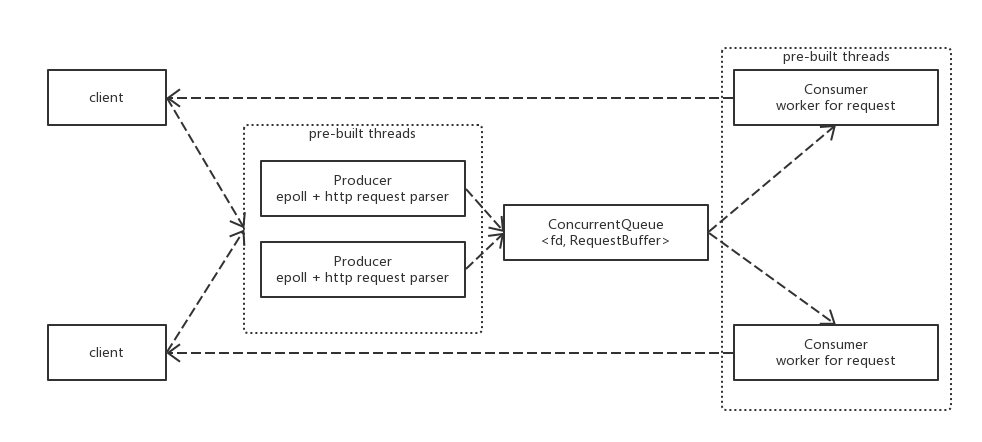

giraffe -- A tiny http server with epoll + pre-threading
==============================================================

基本功能
----------------------------------------

HTTP1.1作为主要支持的协议版本，可以向下兼容到HTTP1.0  
giraffe支持GET、HEAD和POST三种请求方式  
其中GET和HEAD以ip:port/uri的方式，访问uri对应的文件  
POST支持x-www-form-urlencoded格式的参数传输，支持在uri后以?key=value&key2=value2...的方式或在http body中以key=value&key2=value2...的方式，以后者优先  
POST表现内容uri对应一个服务器上的可执行程序，而参数中的每个value则为可执行程序的参数之一，返回text/plain格式的程序执行结果  
giraffe支持对应400、403、404、500、501错误码的异常检测与返回对应错误页面  

特性
-----------------------------------------

### 实现方式

使用c++标准库和相关系统调用从底层系统接口向上搭建本http server，外部库仅使用了一个线程安全队列ConcurrentQueue和gzip压缩用库zlib  

### 基于生产者和消费者模型的epoll + pre-thread设计

使用epoll作为连接的文件描述符管理，并等待一次连接数据拼接为完整的http请求，封装为ConnProducer作为连接生产者，可并行开启多个epoll实例应对高并发情景（main.cpp里仅创建了一个ConnProducer，但其本身是可并行的）  
一次http请求拼接完成后将连接描述符和请求内容加入线程安全队列ConcurrentQueue作为消息队列池供消费者使用  
ConnConsumer作为连接消费者，从队列中读取连接描述符和请求内容做相应的HTTP工作，其Execute是一个轮询，所以可以初始化阶段先创建N个消费者开始执行，避免运行过程中不必要的线程创建于销毁开销  
设计本身是面向高并发和高性能的，但暂时没进行benmark测试，而且因为使用了一些正则表达式解析请求内容可能在性能考量上不太严谨  

### HTTP1.1长连接机制

支持长连接，每个HTTP请求返回后不会立刻中断连接而是keep-alive一段时间，这样客户端再发请求时就不需要再次进行tcp握手等连接开销，也节省了连接资源本身对空间和性能的占用

### graceful shutdown 信号处理

捕捉SIGINT(CTRL+C)信号，使程序意外中断运行前可以先关闭所有的端口监听和连接实例，避免程序结束后发生僵尸进程占用端口等情况

### 文件传输与gzip压缩

用mmap将需要返回的静态文件映射为虚拟内存再调用write函数写socket  
支持对静态文件GET请求gzip压缩body后返回，节省传输带宽，但因为暂时没实现对压缩后gz文件的动态缓存，每次请求如果都需要压缩会影响性能  
事实上更合理地方法可能是预先将需要压缩的文件压缩好存储，避免不必要的压缩运算  

### epoll + select提供可移植性

使用预编译宏判定平台是否为linux，若是则使用epoll作为连接管理(只有Linux支持epoll)，否则使用select替代  

文件结构与大致内容
-----------------------------------------

### ext/

使用的外部库，除了zlib外还有cameron314的[ConcurrentQueue](https://github.com/cameron314/concurrentqueue)作为并发队列  

### site/

用于测试的网站内容，包括一些错误页html和必要的html、css和image等  

### args_tokenizer.h

解析命令行参数(argv)的简易工具类  

### system.h && system.cpp

封装需要用到的系统调用的文件，省去编码中不必要的对return code正确与否的判断，大部分参考自csapp.h和csapp.c  

### http_server.h && http_server.cpp

封装需要用的一些工具类函数，包括利用正则表达式解析请求、根据错误码向客户端下发错误页html的接口、利用管道+进程执行可执行程序并获得输出结果的函数、gzip压缩封装和urlDecode  

### conn_producer.h && conn_producer.cpp

连接生产者，ConnProducer类的Execute()函数用EL边缘触发epoll管理连接套接字的创建与销毁，并有简易的将request字符串封装成RequestBuffer的部分  
完成后将连接文件描述符fd + RequestBuffer加入ConcurrentQueue  
可以作为生产者线程并行

### conn_consumer.h && conn_consumer.cpp

连接消费者，ConnConsumer类的Execute()函数轮询ConcurrentQueue，若获得一个RequestBuffer便执行相应的响应操作(processGET + processPOST + processError)并通过write socket返回给客户端  
可以作为消费者线程并行  

### main.cpp

绑定端口并监听，预创建一定数目的生产者和消费者线程开始工作  